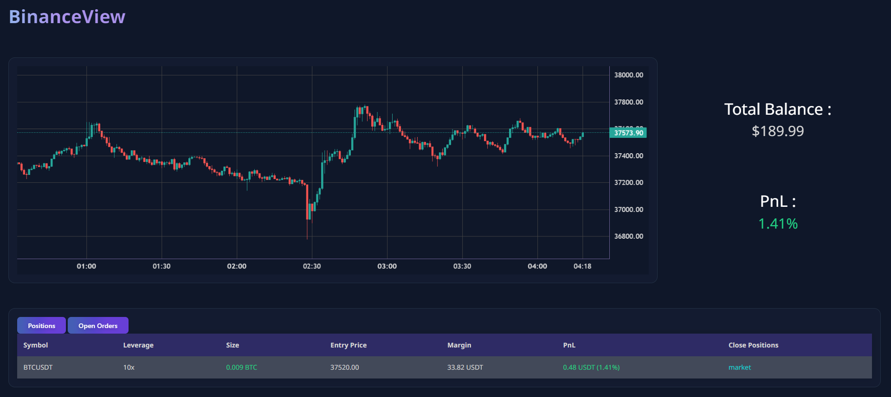

# Webpage Guide

## 개발 환경

웸 페이지 구동을 위해서 다음과 같은 개발 환경이 구축되어야 합니다.

#### 프로그래밍 언어

- python >= 3.8

#### 파이썬 관련 라이브러리

- python-binance >= 1.0.19
- flask

#### node 관련 라이브러리

- nodejs
- wscat

## Custom Files

보안상의 이유로 config.py 파일을 업로드 하지 않았지만 자신의 Binance API Key와 API Secret 정보가 담긴 config.py 파일을 생성하여 web/ 디렉토리 밑에 추가해야 합니다.

예시 : [config.py]

```
API_KEY = "abcdefg1234567"
API_SECRET = "dbacdef0392856"
```

<br/>

Binance API 생성과 관련된 내용은 아래 글을 참고해 주시기 바랍니다.

- [Binance API Mangement](https://www.binance.com/en/support/faq/how-to-create-api-keys-on-binance-360002502072)

## 웹페이지 실행

~/web> 디렉토리에서 다음 명령어를 실행해 주세요

```
flask --app app run
```

app.py 파일을 변경할 때마다 유동적인 변화를 보고 싶다면 --debug 옵션을 추가해주세요.

```
flask --app app run --debug
```

### 실행 결과 예시



